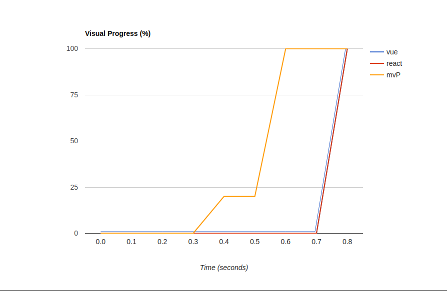
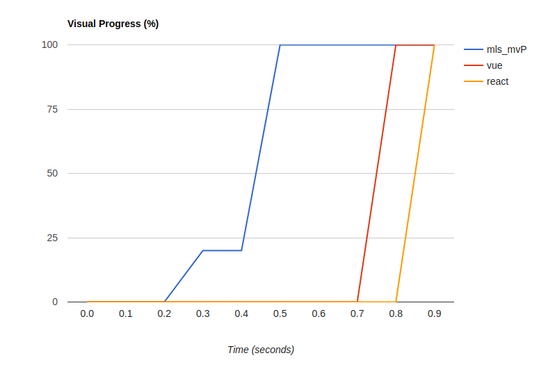
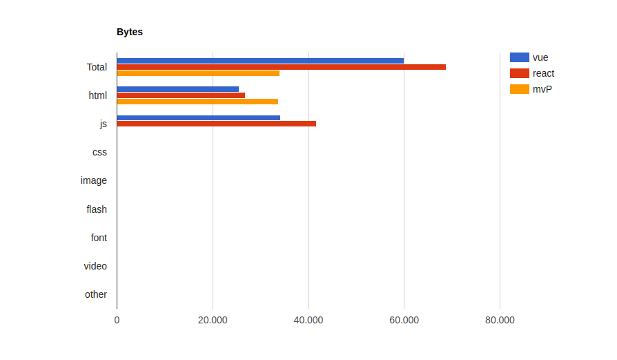

**Vue vs React vs mls_mvP**

The tests were performed as follows:

1- Create a component that renders a table.

2- Render an array of 99 objects with 11 fields.

3- The files were made using both cdn of their frameworks.

4- The files were hosted on aws amazon.

**Access Links:**
    
mls-mvP: https://mlsamazons3testepublish.s3.amazonaws.com/mvP/example3.html    
    
React: https://mlsamazons3testepublish.s3.amazonaws.com/react3/example3.html
      
Vue: https://mlsamazons3testepublish.s3.amazonaws.com/vue/example3.html

**The versions used were:**

React:16

Vue: Vue.js v2.6.10

**Test environment:**

  OS: Linux 5.0 Ubuntu 18.04.3 LTS (Bionic Beaver)
  CPU: (2) x64 Intel(R) Celeron(R) CPU  J1800  @ 2.41GHz       
  Browsers: Chrome: 78.0.3904.87 

**Sites used for benchmarking:**

1-  https://www.webpagetest.org/

**Results:**

#### Loading Sequence

#### Timing Metrics

------

#### Requisitions

------

#### Size (in bytes) 

